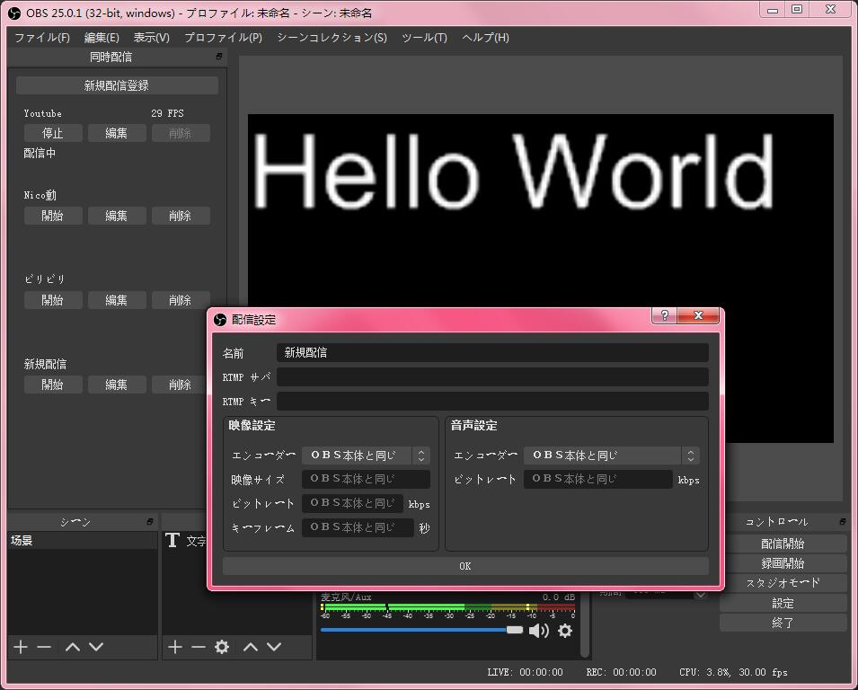

# StreamHub K4 — interface atual

Esta distribuição acrescenta três painéis nativos ao OBS:

- **Múltiplas saídas · K4**, com a transmissão principal primeiro e destinos adicionais abaixo;
- **StreamHub Chat · K4**, com leitura, envio, filtros, moderação e recompensas;
- **Informações de transmissão K4**, com autorização Twitch/YouTube e editor da live com prévia e busca visual de categoria.

A DLL inclui recursos, ícones, traduções e servidor local. Configuração pública, tokens OAuth e stream keys permanecem separados. A autorização Twitch/YouTube é feita uma vez por instalação e renovada automaticamente.

## Estado de desenvolvimento — 07/09/2026

- OAuth YouTube validado no navegador externo; callback local retornou **YouTube conectado ao StreamHub**.
- Painel de transmissão ainda precisa corrigir consulta YouTube com parâmetros incompatíveis `mine` e `broadcastStatus`.
- Resultado Twitch ainda menciona notificação, embora esse campo não exista na API Twitch; resposta deve ser ajustada.
- Próxima etapa: corrigir consulta YouTube/Twitch, integrar Kick OAuth oficial e sincronizar automaticamente servidor RTMP, stream key e destinos em **Múltiplas saídas** ao conectar plataformas, mesmo sem live ou destino pré-configurado. Preservar configurações existentes e nunca expor stream keys.
- Kick deverá usar OAuth por navegador externo, callback local, refresh token e escopos oficiais para chat, moderação e leitura de `streamkey:read`.
- Ponte futura Node/C++ deverá ser local, autenticada e temporária; chaves não serão enviadas em logs, documentação, URLs ou eventos comuns.

Contexto detalhado: [contexto.md](../contexto.md). Implementação aguarda aprovação do plano.

<!-- registro histórico -->

Esta documentação não representa conclusão da sincronização automática nem da transmissão real.

<!-- Global site tag (gtag.js) - Google Analytics -->

# StreamHub — 現在の統合状況

2026-09-07時点で、YouTube OAuthは外部ブラウザとローカルコールバックを使って検証済みです。YouTubeの配信読み込みには、`mine` と `broadcastStatus` を同時指定している既知のAPIエラーがあります。Twitchの通知項目はAPIに存在しないため、更新失敗ではなく無視された項目として表示する必要があります。

次の実装では、Kick公式OAuth、PKCE、ローカルコールバック、refresh token、認証済みチャット、権限がある場合のモデレーション、`streamkey:read` による認証済み配信キー取得を追加します。接続後、公式に取得できるRTMPサーバーと配信キーをネイティブ出力へ同期し、配信や出力先が事前設定されていなくても対応する出力先を作成します。既存の順序、名前、encoder、詳細設定、他サービスの出力先は保持します。

Node.jsはプラットフォームAPIと認証情報、C++はOBSネイティブ出力と `GlobalMultiOutputConfig()` を管理します。将来の橋渡しはローカル、認証付き、一時的とし、秘密情報をURL、ログ、通常イベント、ドキュメント、Gitへ流しません。詳細は [contexto.md](../contexto.md) を参照してください。実装は計画承認後に開始します。

# OBS 同時配信プラグイン

本プラグインは複数のサイトで同時配信を行なうために作ってみた物です。

# スクリーンショット

# ダウンロード

[リリースページ](https://github.com/sorayuki/obs-multi-rtmp/releases/)

現在、更新の自動チェック機能は搭載していません。

# Windows版インストール手順

## インストーラーを使用する場合

そのままインストールを実行してください。

インストール先のフォルダーは変更をしないでください。

## ポータブル版の場合

圧縮ファイルを展開後に「C:\Program Files\obs-studio」へファイルを配置してください。

## アンインストール

インストーラーを使用してアンインストールが行えます。

インストーラーでこのプラグインが正しく削除できなかった場合は、「C:\ProgramData\obs-studio\plugins\obs-multi-rtmp」のフォルダーを削除で消す事ができます。ファイル名を指定して実行で「%programdata%」と入力すると対象のフォルダーを開く事ができます。

「ProgramData」は通常だと非表示になっているのでご注意ください。

# インストール要件 (Windows版)

 OBS-Studioのバージョンに合わせてください。

# よくある質問 (FAQ)

**Q: 同時配信のドックウィンドウが表示されなくなりました。ドックをリセットしても変りません。**

A: たまに発生するバグのようです。原因は不明ですが、以下の手順でドックをリセットする事が可能です。

スタジオモードに変更をするとドックウィンドウが表示されるかもしれません。

もし、それでも表示がされない場合は

1. 「ヘルプ　→　ログファイル　→　ログファイルを表示」を行なう
2. OBSを終了する
3. 「AppData\Roaming\obs-studio」の格納先を開く(ファイル名を指定して実行で「%appdata%」と入力すると対象のフォルダーを開く事ができます)
4. 「global.ini」をテキストエディタで開く
5. DockState=XXXXXXXX(長い文字列になっています)を探す
6. その行を削除をし、保存をする

の手順で直ると思います。

# ビルド方法

断続的インテグレーションのスクリプトをご参照ください。

# 寄付 / Donate

如果你觉得这个工具很有用想要捐赠，这里是链接。注意：这不是提需求的渠道。

このツールの開発に支援もとい投げ銭をしたいと思った方は以下のリンクからお願いします。(機能のリクエストは受け付けていません)

If you regard this tool useful and want to doante for some, here is the link. (It's not for feature request.)

## PayPal / 贝宝
[PayPal / 贝宝](https://paypal.me/sorayuki0)

## AliPay または WeChat / 支付宝或微信

[AliPay](./zhi.png) 

[WeChat](./wechat.jpg)
